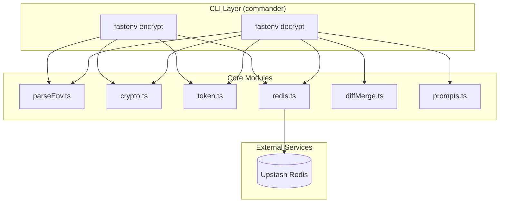
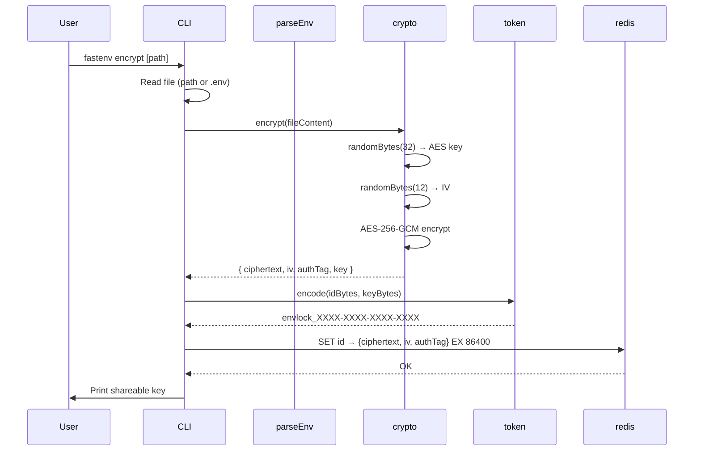
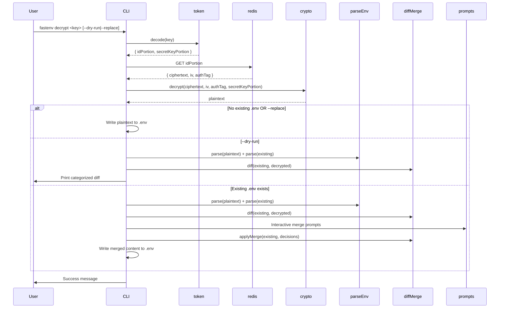

# Design Document

## Overview

fastenv is a Node.js CLI tool that provides secure, ephemeral sharing of .env files between developers. The architecture follows a client-side encryption model where all cryptographic operations happen locally — Upstash Redis serves only as a blind relay for opaque ciphertext blobs with automatic 24-hour expiry.

The tool exposes two primary commands (`encrypt` and `decrypt`) and handles the full lifecycle: parsing .env files into structured data, encrypting content with AES-256-GCM, encoding keys into a human-friendly token format, uploading/downloading from Redis, and intelligently merging decrypted content into existing local .env files.

The project is written in TypeScript with ESM module system, compiled via `tsx` for development and `tsc` for production builds.

### Key Design Decisions

| Decision | Choice | Rationale |
|----------|--------|-----------|
| Language | TypeScript | Type safety, better IDE support, catch errors at compile time |
| Crypto library | Node.js built-in `crypto` | Zero dependencies for security-critical code; auditable, well-tested |
| Encryption algorithm | AES-256-GCM | Authenticated encryption prevents tampering; industry standard |
| Storage | Upstash Redis via `@upstash/redis` | Serverless REST API — no infrastructure to manage, HTTP-only |
| Token format | `envlock_XXXX-XXXX-XXXX-XXXX` | Human-readable, voice-safe, unambiguous characters |
| CLI framework | `commander` | Lightweight, widely adopted, minimal footprint |
| Interactive prompts | `inquirer` | Rich prompt types, mature ecosystem |
| Test framework | `vitest` + `fast-check` | Fast execution, native ESM, excellent PBT integration |
| Module system | ES Modules (ESM) | Modern Node.js standard, native `import/export` |
| Execution | `tsx` (dev) / `tsc` (build) | Fast dev iteration, standard compiled output for distribution |

## Architecture



### Project Structure

```
fastenv/
├── bin/
│   └── fastenv.ts              # CLI entry point
├── src/
│   ├── crypto.ts             # AES-256-GCM encrypt/decrypt
│   ├── token.ts              # Shareable key encode/decode
│   ├── redis.ts              # Upstash Redis client wrapper
│   ├── parseEnv.ts           # .env file parser and pretty-printer
│   ├── diffMerge.ts          # Diff categorization and merge logic
│   ├── prompts.ts            # Interactive merge prompts
│   ├── commands/
│   │   ├── encrypt.ts        # Encrypt command handler
│   │   └── decrypt.ts        # Decrypt command handler
│   └── types.ts              # Shared type definitions
├── tests/
│   ├── crypto.test.ts
│   ├── token.test.ts
│   ├── parseEnv.test.ts
│   ├── diffMerge.test.ts
│   ├── integration.test.ts
│   └── properties.test.ts   # Property-based tests with fast-check
├── package.json
├── tsconfig.json
└── vitest.config.ts
```

### Encrypt Flow



### Decrypt Flow



## Components and Interfaces

### `src/types.ts`

Shared type definitions used across modules.

```typescript
/** Structural element types in a parsed .env file */
export type EnvEntryType = 'keyvalue' | 'comment' | 'blank' | 'unknown';

/** Quoting style for values */
export type QuoteStyle = 'single' | 'double' | 'none';

/** A single structural element from a parsed .env file */
export interface EnvEntry {
  type: EnvEntryType;
  key?: string;
  value?: string;
  raw: string;
  exported?: boolean;
  quoteStyle?: QuoteStyle;
}

/** The encrypted payload stored in Redis */
export interface CiphertextBlob {
  ciphertext: string;
  iv: string;
  authTag: string;
}

/** Result of an encryption operation */
export interface EncryptResult {
  blob: CiphertextBlob;
  key: Buffer;
}

/** Decoded token components */
export interface DecodedToken {
  id: Buffer;
  secretKey: Buffer;
}

/** A key that exists in incoming but not in existing */
export interface NewKey {
  key: string;
  value: string;
}

/** A key that exists in both with different values */
export interface ChangedKey {
  key: string;
  currentValue: string;
  newValue: string;
}

/** A key that exists in both with identical values */
export interface UnchangedKey {
  key: string;
  value: string;
}

/** Result of diffing existing vs incoming env entries */
export interface DiffResult {
  newKeys: NewKey[];
  changedKeys: ChangedKey[];
  unchangedKeys: UnchangedKey[];
}
```

### `src/crypto.ts`

Handles all cryptographic operations using the Node.js built-in `crypto` module.

```typescript
import { randomBytes, createCipheriv, createDecipheriv } from 'node:crypto';
import type { CiphertextBlob, EncryptResult } from './types.js';

/**
 * Encrypts plaintext using AES-256-GCM.
 * Generates a fresh 256-bit key and 96-bit IV for each call.
 */
export function encrypt(plaintext: Buffer | string): EncryptResult {
  const key = randomBytes(32);
  const iv = randomBytes(12);
  const cipher = createCipheriv('aes-256-gcm', key, iv);

  const encrypted = Buffer.concat([
    cipher.update(typeof plaintext === 'string' ? Buffer.from(plaintext) : plaintext),
    cipher.final(),
  ]);

  const authTag = cipher.getAuthTag();

  return {
    blob: {
      ciphertext: encrypted.toString('hex'),
      iv: iv.toString('hex'),
      authTag: authTag.toString('hex'),
    },
    key,
  };
}

/**
 * Decrypts ciphertext using AES-256-GCM.
 * @throws Error with message containing "authentication" if tag verification fails
 */
export function decrypt(blob: CiphertextBlob, key: Buffer): Buffer {
  const decipher = createDecipheriv(
    'aes-256-gcm',
    key,
    Buffer.from(blob.iv, 'hex')
  );
  decipher.setAuthTag(Buffer.from(blob.authTag, 'hex'));

  const decrypted = Buffer.concat([
    decipher.update(Buffer.from(blob.ciphertext, 'hex')),
    decipher.final(),
  ]);

  return decrypted;
}
```

### `src/token.ts`

Encodes and decodes the shareable key token using a custom base32 alphabet.

```typescript
import type { DecodedToken } from './types.js';

/**
 * Custom base32 alphabet excluding ambiguous characters (0/O, 1/l/I).
 * 32 characters: 2-9, A-H, J-N, P-T, V-Z (uppercase canonical)
 */
export const ALPHABET = '23456789ABCDEFGHJKLMNPQRSTVWXYZ' as const;

const PREFIX = 'envlock_';

/**
 * Encodes an ID and secret key into a shareable token.
 * @param id - Cryptographically random ID bytes (8 bytes)
 * @param secretKey - The 256-bit AES key (32 bytes)
 * @returns Token in format envlock_XXXX-XXXX-XXXX-XXXX...
 */
export function encode(id: Buffer, secretKey: Buffer): string {
  const combined = Buffer.concat([id, secretKey]); // 40 bytes
  const encoded = base32Encode(combined);
  const chunks = encoded.match(/.{1,4}/g)!;
  return PREFIX + chunks.join('-');
}

/**
 * Decodes a shareable token back into ID and secret key.
 * Accepts case-insensitive input.
 * @throws Error if token format is invalid
 */
export function decode(token: string): DecodedToken {
  const raw = token.startsWith(PREFIX.toLowerCase()) || token.startsWith(PREFIX)
    ? token.slice(PREFIX.length)
    : token;

  const normalized = raw.replace(/-/g, '').toUpperCase();
  const bytes = base32Decode(normalized);

  if (bytes.length !== 40) {
    throw new Error('Invalid token: expected 40 bytes after decoding');
  }

  return {
    id: bytes.subarray(0, 8),
    secretKey: bytes.subarray(8, 40),
  };
}

function base32Encode(buffer: Buffer): string {
  // Encode bytes to base32 using ALPHABET
  // Implementation: convert to bits, take 5 at a time, map to ALPHABET
  let bits = '';
  for (const byte of buffer) {
    bits += byte.toString(2).padStart(8, '0');
  }
  let result = '';
  for (let i = 0; i < bits.length; i += 5) {
    const chunk = bits.slice(i, i + 5).padEnd(5, '0');
    result += ALPHABET[parseInt(chunk, 2)];
  }
  return result;
}

function base32Decode(encoded: string): Buffer {
  // Decode base32 string back to bytes using ALPHABET
  let bits = '';
  for (const char of encoded) {
    const index = ALPHABET.indexOf(char);
    if (index === -1) {
      throw new Error(`Invalid character in token: ${char}`);
    }
    bits += index.toString(2).padStart(5, '0');
  }
  const bytes: number[] = [];
  for (let i = 0; i + 8 <= bits.length; i += 8) {
    bytes.push(parseInt(bits.slice(i, i + 8), 2));
  }
  return Buffer.from(bytes);
}
```

**Token Structure:**

The token encodes 40 bytes (8 bytes ID + 32 bytes key) into a base32 string with dash separators every 4 characters. The resulting token is `envlock_` followed by 16 groups of 4 characters separated by dashes (64 chars encode 40 bytes at ~5 bits/char = 320 bits ≈ 40 bytes).

The encoding works as follows:
1. Concatenate `idBytes` (8 bytes) + `keyBytes` (32 bytes) = 40 bytes
2. Encode the 40-byte buffer into base32 using the custom alphabet → 64 characters
3. Split into groups of 4 characters, join with dashes
4. Prepend `envlock_`

Decoding reverses the process, with case-insensitive character matching.

### `src/redis.ts`

Wraps `@upstash/redis` for storing and retrieving ciphertext blobs.

```typescript
import { Redis } from '@upstash/redis';
import type { CiphertextBlob } from './types.js';

const EXPIRY_SECONDS = 86400;

/**
 * Creates and validates the Redis client from environment variables.
 * @throws Error if UPSTASH_REDIS_REST_URL or UPSTASH_REDIS_REST_TOKEN not set
 */
export function createClient(): Redis {
  const url = process.env.UPSTASH_REDIS_REST_URL;
  const token = process.env.UPSTASH_REDIS_REST_TOKEN;

  if (!url) {
    throw new Error('Missing environment variable: UPSTASH_REDIS_REST_URL');
  }
  if (!token) {
    throw new Error('Missing environment variable: UPSTASH_REDIS_REST_TOKEN');
  }

  return new Redis({ url, token });
}

/**
 * Stores a ciphertext blob in Redis with 24h expiry.
 * @throws Error if connection fails
 */
export async function store(id: string, blob: CiphertextBlob): Promise<void> {
  const client = createClient();
  await client.set(id, JSON.stringify(blob), { ex: EXPIRY_SECONDS });
}

/**
 * Retrieves a ciphertext blob from Redis.
 * @throws Error if key not found, data corrupted, or connection fails
 */
export async function retrieve(id: string): Promise<CiphertextBlob> {
  const client = createClient();
  const data = await client.get<string>(id);

  if (data === null) {
    throw new Error('Key not found or expired');
  }

  const parsed = typeof data === 'string' ? JSON.parse(data) : data;

  if (
    !parsed.ciphertext || typeof parsed.ciphertext !== 'string' ||
    !parsed.iv || typeof parsed.iv !== 'string' ||
    !parsed.authTag || typeof parsed.authTag !== 'string'
  ) {
    throw new Error('Corrupted data: missing required fields');
  }

  return parsed as CiphertextBlob;
}
```

### `src/parseEnv.ts`

Parses .env file content into structured elements and serializes back.

```typescript
import type { EnvEntry, QuoteStyle } from './types.js';

/**
 * Parses .env file content into structured entries.
 */
export function parse(content: string): EnvEntry[] {
  const entries: EnvEntry[] = [];
  const lines = content.split('\n');
  let i = 0;

  while (i < lines.length) {
    const line = lines[i];

    // Blank line
    if (line.trim() === '') {
      entries.push({ type: 'blank', raw: line });
      i++;
      continue;
    }

    // Comment line
    if (/^\s*#/.test(line)) {
      entries.push({ type: 'comment', raw: line });
      i++;
      continue;
    }

    // KEY=value line (with optional export prefix)
    const match = line.match(/^(export\s+)?([A-Za-z_]\w*)\s*=\s*(.*)/);
    if (match) {
      const exported = !!match[1];
      const key = match[2];
      const rawValue = match[3];
      const { value, quoteStyle, rawLines } = parseValue(rawValue, lines, i);

      entries.push({
        type: 'keyvalue',
        key,
        value,
        raw: rawLines.join('\n'),
        exported,
        quoteStyle,
      });
      i += rawLines.length;
      continue;
    }

    // Unknown line
    entries.push({ type: 'unknown', raw: line });
    i++;
  }

  return entries;
}

/**
 * Serializes structured entries back into .env file content.
 */
export function stringify(entries: EnvEntry[]): string {
  return entries.map((entry) => entry.raw).join('\n');
}

/**
 * Extracts a key-value map from entries (ignoring structure).
 */
export function toMap(entries: EnvEntry[]): Map<string, string> {
  const map = new Map<string, string>();
  for (const entry of entries) {
    if (entry.type === 'keyvalue' && entry.key !== undefined && entry.value !== undefined) {
      map.set(entry.key, entry.value);
    }
  }
  return map;
}

function parseValue(
  rawValue: string,
  lines: string[],
  startLine: number
): { value: string; quoteStyle: QuoteStyle; rawLines: string[] } {
  // Handle quoted multi-line values, single-quoted literals,
  // double-quoted with escapes, and unquoted values
  // (implementation handles all cases per requirements)
  // ...
  return { value: '', quoteStyle: 'none', rawLines: [lines[startLine]] };
}
```

### `src/diffMerge.ts`

Computes the diff between existing and incoming .env entries and applies merge decisions.

```typescript
import type { DiffResult, EnvEntry, NewKey, ChangedKey } from './types.js';

/**
 * Categorizes keys into new, changed, and unchanged buckets.
 * Values are compared as trimmed strings.
 */
export function diff(
  existing: Map<string, string>,
  incoming: Map<string, string>
): DiffResult {
  const newKeys: DiffResult['newKeys'] = [];
  const changedKeys: DiffResult['changedKeys'] = [];
  const unchangedKeys: DiffResult['unchangedKeys'] = [];

  for (const [key, value] of incoming) {
    const existingValue = existing.get(key);
    if (existingValue === undefined) {
      newKeys.push({ key, value });
    } else if (existingValue.trim() !== value.trim()) {
      changedKeys.push({ key, currentValue: existingValue, newValue: value });
    } else {
      unchangedKeys.push({ key, value });
    }
  }

  return { newKeys, changedKeys, unchangedKeys };
}

/**
 * Applies merge decisions to produce final .env content.
 * - Accepted changes are updated in-place at their original position
 * - Accepted new keys are appended under a dated comment header
 * - All other structural elements (comments, blanks, unchanged keys) are preserved
 */
export function applyMerge(
  existingEntries: EnvEntry[],
  acceptedNew: NewKey[],
  acceptedChanges: ChangedKey[]
): string {
  const changeMap = new Map(acceptedChanges.map((c) => [c.key, c.newValue]));
  const lines: string[] = [];

  for (const entry of existingEntries) {
    if (entry.type === 'keyvalue' && entry.key && changeMap.has(entry.key)) {
      // Update value in-place, preserving quote style and export prefix
      const newValue = changeMap.get(entry.key)!;
      const prefix = entry.exported ? 'export ' : '';
      const quoted = formatValue(newValue, entry.quoteStyle ?? 'none');
      lines.push(`${prefix}${entry.key}=${quoted}`);
    } else {
      lines.push(entry.raw);
    }
  }

  if (acceptedNew.length > 0) {
    const date = new Date().toISOString().split('T')[0];
    lines.push(`# --- added by fastenv ${date} ---`);
    for (const { key, value } of acceptedNew) {
      lines.push(`${key}=${value}`);
    }
  }

  return lines.join('\n');
}

function formatValue(value: string, quoteStyle: QuoteStyle): string {
  switch (quoteStyle) {
    case 'single': return `'${value}'`;
    case 'double': return `"${value.replace(/\\/g, '\\\\').replace(/"/g, '\\"')}"`;
    default: return value;
  }
}
```

### `src/prompts.ts`

Interactive merge prompts using `inquirer`.

```typescript
import type { NewKey, ChangedKey } from './types.js';

/**
 * Prompts user for each new key.
 * @returns Accepted new keys
 */
export async function promptNewKeys(newKeys: NewKey[]): Promise<NewKey[]> {
  const { default: inquirer } = await import('inquirer');
  const accepted: NewKey[] = [];

  for (const entry of newKeys) {
    const { confirm } = await inquirer.prompt([{
      type: 'confirm',
      name: 'confirm',
      message: `Add ${entry.key}=${entry.value}?`,
      default: true,
    }]);
    if (confirm) accepted.push(entry);
  }

  return accepted;
}

/**
 * Prompts user for each changed key showing old and new values.
 * @returns Accepted changed keys with new values
 */
export async function promptChangedKeys(changedKeys: ChangedKey[]): Promise<ChangedKey[]> {
  const { default: inquirer } = await import('inquirer');
  const accepted: ChangedKey[] = [];

  for (const entry of changedKeys) {
    console.log(`  current: ${entry.currentValue}`);
    console.log(`  new:     ${entry.newValue}`);
    const { confirm } = await inquirer.prompt([{
      type: 'confirm',
      name: 'confirm',
      message: `Overwrite ${entry.key}?`,
      default: false,
    }]);
    if (confirm) accepted.push(entry);
  }

  return accepted;
}
```

### `src/commands/encrypt.ts`

Orchestrates the encrypt flow.

```typescript
import { readFile } from 'node:fs/promises';
import { resolve } from 'node:path';
import { randomBytes } from 'node:crypto';
import { encrypt } from '../crypto.js';
import { encode } from '../token.js';
import { store } from '../redis.js';

/**
 * Encrypt command handler.
 */
export async function encryptCommand(filePath?: string): Promise<void> {
  const target = resolve(filePath ?? '.env');

  const content = await readFile(target, 'utf-8');
  const { blob, key } = encrypt(content);

  const id = randomBytes(8);
  const token = encode(id, key);

  const idHex = id.toString('hex');
  await store(idHex, blob);

  console.log(token);
}
```

### `src/commands/decrypt.ts`

Orchestrates the decrypt flow.

```typescript
import { readFile, writeFile, access } from 'node:fs/promises';
import { resolve } from 'node:path';
import { decrypt } from '../crypto.js';
import { decode } from '../token.js';
import { retrieve } from '../redis.js';
import { parse, toMap, stringify } from '../parseEnv.js';
import { diff, applyMerge } from '../diffMerge.js';
import { promptNewKeys, promptChangedKeys } from '../prompts.js';

interface DecryptOptions {
  dryRun?: boolean;
  replace?: boolean;
}

/**
 * Decrypt command handler.
 */
export async function decryptCommand(key: string, options: DecryptOptions): Promise<void> {
  if (options.dryRun && options.replace) {
    console.error('Error: --dry-run and --replace are mutually exclusive');
    process.exit(1);
  }

  const { id, secretKey } = decode(key);
  const idHex = id.toString('hex');

  const blob = await retrieve(idHex);
  const plaintext = decrypt(blob, secretKey).toString('utf-8');

  const envPath = resolve('.env');
  let existingContent: string | null = null;

  try {
    await access(envPath);
    existingContent = await readFile(envPath, 'utf-8');
  } catch {
    // File doesn't exist
  }

  if (options.replace || existingContent === null) {
    if (!options.dryRun) {
      await writeFile(envPath, plaintext, 'utf-8');
      console.log(existingContent === null ? 'Created .env' : 'Replaced .env');
    } else {
      const entries = parse(plaintext);
      const map = toMap(entries);
      console.log(`New keys (${map.size}):`);
      for (const [k, v] of map) console.log(`  ${k}=${v}`);
    }
    return;
  }

  // Merge flow
  const existingEntries = parse(existingContent);
  const incomingEntries = parse(plaintext);
  const existingMap = toMap(existingEntries);
  const incomingMap = toMap(incomingEntries);
  const result = diff(existingMap, incomingMap);

  if (options.dryRun) {
    console.log(`New keys (${result.newKeys.length}):`);
    result.newKeys.forEach((k) => console.log(`  ${k.key}=${k.value}`));
    console.log(`Changed keys (${result.changedKeys.length}):`);
    result.changedKeys.forEach((k) => console.log(`  ${k.key}: ${k.currentValue} → ${k.newValue}`));
    console.log(`Unchanged keys (${result.unchangedKeys.length})`);
    return;
  }

  const acceptedNew = await promptNewKeys(result.newKeys);
  const acceptedChanges = await promptChangedKeys(result.changedKeys);
  const merged = applyMerge(existingEntries, acceptedNew, acceptedChanges);
  await writeFile(envPath, merged, 'utf-8');
  console.log('Merged .env updated');
}
```

### `bin/fastenv.ts`

Entry point with commander setup.

```typescript
#!/usr/bin/env node
import { program } from 'commander';
import { readFileSync } from 'node:fs';
import { resolve, dirname } from 'node:path';
import { fileURLToPath } from 'node:url';
import { encryptCommand } from '../src/commands/encrypt.js';
import { decryptCommand } from '../src/commands/decrypt.js';

const __dirname = dirname(fileURLToPath(import.meta.url));
const pkg = JSON.parse(readFileSync(resolve(__dirname, '../package.json'), 'utf-8'));

program
  .name('fastenvnv')
  .description('Securely share .env files with teammates')
  .version(pkg.version);

program
  .command('encrypt [path]')
  .description('Encrypt a .env file and get a shareable key')
  .action(encryptCommand);

program
  .command('decrypt <key>')
  .description('Decrypt a shareable key and merge into local .env')
  .option('--dry-run', 'Preview changes without writing to disk')
  .option('--replace', 'Overwrite existing .env without prompting')
  .action(decryptCommand);

program.parse();
```

## Data Models

### Ciphertext Blob (stored in Redis)

```json
{
  "ciphertext": "<hex-encoded encrypted bytes>",
  "iv": "<hex-encoded 12-byte IV>",
  "authTag": "<hex-encoded 16-byte authentication tag>"
}
```

All fields are hex-encoded strings. The blob is JSON-serialized before storing in Redis.

### EnvEntry (internal structured representation)

```typescript
// Key-value entry
const kvEntry: EnvEntry = {
  type: 'keyvalue',
  key: 'DATABASE_URL',
  value: 'postgres://localhost:5432/app',
  raw: 'DATABASE_URL=postgres://localhost:5432/app',
  exported: false,
  quoteStyle: 'none',
};

// Comment entry
const commentEntry: EnvEntry = {
  type: 'comment',
  raw: '# Database configuration',
};

// Blank line entry
const blankEntry: EnvEntry = {
  type: 'blank',
  raw: '',
};

// Unrecognized line (preserved as-is)
const unknownEntry: EnvEntry = {
  type: 'unknown',
  raw: 'some weird line that does not match patterns',
};
```

### Token Encoding Layout

```
envlock_XXXX-XXXX-XXXX-XXXX-XXXX-XXXX-XXXX-XXXX-XXXX-XXXX-XXXX-XXXX-XXXX-XXXX-XXXX-XXXX
        |<---------- 64 base32 characters (40 bytes encoded) ---------->|
        |<-- 8 bytes (ID) -->|<------------ 32 bytes (AES key) ------------>|
```

- **ID Portion**: First 13 base32 characters → 8 bytes (64 bits of randomness for collision avoidance)
- **Secret Key Portion**: Remaining 51 base32 characters → 32 bytes (256-bit AES key)
- Characters: `23456789ABCDEFGHJKLMNPQRSTVWXYZ` (32 chars, no 0/O/1/l/I)
- Parsing is case-insensitive (lowercase input normalized to uppercase before decode)

### DiffResult

```typescript
const example: DiffResult = {
  newKeys: [
    { key: 'NEW_API_KEY', value: 'abc123' },
  ],
  changedKeys: [
    { key: 'DATABASE_URL', currentValue: 'localhost', newValue: 'prod-server' },
  ],
  unchangedKeys: [
    { key: 'PORT', value: '3000' },
  ],
};
```

### Package Configuration

**package.json**
```json
{
  "name": "fastenvnvnv",
  "version": "1.0.0",
  "type": "module",
  "bin": {
    "fastenvnvnvnv": "./disfafafafafafafafafafafafafafastfastfafastenvnvnvnvnvnv/elock.js"
  },
  "scripts": {
    "build": "tsc",
    "dev": "tsx bin/fastenv.ts",
    "test": "vitest --run",
    "test:watch": "vitest"
  },
  "dependencies": {
    "@upstash/redis": "^1.34.0",
    "commander": "^12.0.0",
    "inquirer": "^9.0.0"
  },
  "devDependencies": {
    "@types/inquirer": "^9.0.0",
    "@types/node": "^20.0.0",
    "fast-check": "^3.0.0",
    "tsx": "^4.0.0",
    "typescript": "^5.5.0",
    "vitest": "^2.0.0"
  }
}
```

**tsconfig.json**
```json
{
  "compilerOptions": {
    "target": "ES2022",
    "module": "NodeNext",
    "moduleResolution": "NodeNext",
    "outDir": "./dist",
    "rootDir": ".",
    "strict": true,
    "esModuleInterop": true,
    "skipLibCheck": true,
    "forceConsistentCasingInFileNames": true,
    "declaration": true,
    "declarationMap": true,
    "sourceMap": true,
    "resolveJsonModule": true
  },
  "include": ["src/**/*.ts", "bin/**/*.ts"],
  "exclude": ["node_modules", "dist", "tests"]
}
```

**vitest.config.ts**
```typescript
import { defineConfig } from 'vitest/config';

export default defineConfig({
  test: {
    globals: true,
    include: ['tests/**/*.test.ts'],
  },
});
```

## Correctness Properties

*A property is a characteristic or behavior that should hold true across all valid executions of a system — essentially, a formal statement about what the system should do. Properties serve as the bridge between human-readable specifications and machine-verifiable correctness guarantees.*

### Property 1: Crypto encrypt/decrypt round-trip

*For any* arbitrary byte sequence (including empty, single-byte, and multi-kilobyte inputs), encrypting with `encrypt()` then decrypting the resulting blob with the returned key using `decrypt()` SHALL produce a buffer identical to the original input.

**Validates: Requirements 1.4, 2.3, 7.3, 10.1**

### Property 2: Token encode/decode round-trip

*For any* random 8-byte ID and 32-byte secret key, encoding them with `encode(id, secretKey)` then decoding the resulting token string with `decode()` SHALL produce buffers identical to the original ID and secret key.

**Validates: Requirements 5.3, 5.5, 5.7, 10.2**

### Property 3: Token case-insensitive decode

*For any* valid token produced by `encode()`, converting the token to lowercase (or any mixed-case variant) and then decoding it SHALL produce the same ID and secret key as decoding the original uppercase token.

**Validates: Requirements 5.6**

### Property 4: .env parse/stringify round-trip

*For any* valid .env file content, `parse(stringify(parse(content)))` SHALL produce an array of `EnvEntry` objects with identical keys, values, and element ordering as `parse(content)`. That is, parsing then pretty-printing then re-parsing is idempotent on the structured representation.

**Validates: Requirements 6.1, 6.2, 6.3, 6.4, 6.5, 6.6, 6.8, 6.9, 10.3**

### Property 5: Diff exhaustive partitioning

*For any* two key-value maps (existing and incoming), calling `diff(existing, incoming)` SHALL produce three buckets (newKeys, changedKeys, unchangedKeys) where: (a) every key in the incoming map appears in exactly one bucket, (b) no key appears in more than one bucket, and (c) the total count of keys across all buckets equals the number of keys in the incoming map.

**Validates: Requirements 4.1, 10.4**

### Property 6: Merge structural preservation

*For any* list of existing `EnvEntry` elements and any set of merge decisions (accepted new keys and accepted changes), calling `applyMerge()` SHALL produce output where all comment entries, blank line entries, and unchanged key-value entries appear in the same relative order as in the original entries, with their `raw` content unmodified.

**Validates: Requirements 4.5, 4.6, 4.8, 10.5**

## Error Handling

Errors are categorized by source and severity. All errors result in a non-zero exit code and a user-facing message on stderr. No error path ever reveals plaintext secrets, decryption keys, or Redis credentials.

### Error Categories

| Category | Source | Exit Code | User Message Pattern |
|----------|--------|-----------|---------------------|
| File Not Found | Filesystem | 1 | `Error: File not found: <path>` |
| File Not Readable | Filesystem | 1 | `Error: Cannot read file: <path>` |
| File Write Failure | Filesystem | 1 | `Error: Cannot write file: <path>` |
| Invalid Token Format | Input validation | 1 | `Error: Invalid key format. Expected envlock_XXXX-XXXX-...` |
| Missing Argument | Input validation | 1 | `Error: <argument> is required` |
| Mutually Exclusive Flags | Input validation | 1 | `Error: --dry-run and --replace are mutually exclusive` |
| Missing Env Var | Configuration | 1 | `Error: Missing environment variable: <VAR_NAME>` |
| Redis Connection Failed | Network | 1 | `Error: Could not connect to Redis. Check your connection.` |
| Key Not Found / Expired | Redis | 1 | `Error: Key not found or expired` |
| Corrupted Data | Redis | 1 | `Error: Retrieved data is corrupted or incomplete` |
| Authentication Failed | Crypto | 1 | `Error: Decryption failed — key is incorrect or data was tampered with` |

### Error Handling Strategy

```typescript
/** Custom error classes for typed error handling */
export class fastenvError extends Error {
  constructor(message: string, public readonly exitCode: number = 1) {
    super(message);
    this.name = 'fastenvError';
  }
}

export class FileError extends fastenvError {
  constructor(message: string) { super(message); this.name = 'FileError'; }
}

export class TokenError extends fastenvError {
  constructor(message: string) { super(message); this.name = 'TokenError'; }
}

export class RedisError extends fastenvError {
  constructor(message: string) { super(message); this.name = 'RedisError'; }
}

export class CryptoError extends fastenvError {
  constructor(message: string) { super(message); this.name = 'CryptoError'; }
}

export class ConfigError extends fastenvError {
  constructor(message: string) { super(message); this.name = 'ConfigError'; }
}
```

### Error Flow

1. Each module throws typed errors (`FileError`, `TokenError`, etc.) with safe messages
2. The command handler catches errors at the top level
3. If the error is an `fastenvnvError`, its message is printed to stderr and `process.exit(exitCode)` is called
4. If the error is unexpected, a generic "An unexpected error occurred" message is printed — no stack traces or internal state are exposed in production

### Security Constraints on Errors

- `CryptoError` messages NEVER include key material, plaintext, or ciphertext
- `RedisError` messages NEVER include the `UPSTASH_REDIS_REST_URL` or `UPSTASH_REDIS_REST_TOKEN`
- Stack traces are only shown when `NODE_ENV=development`
- Error messages from underlying libraries (e.g., `@upstash/redis`) are sanitized before surfacing to the user

## Testing Strategy

### Test Framework Configuration

- **Test runner**: `vitest` with native ESM support
- **Property-based testing**: `fast-check` (minimum 100 iterations per property)
- **Mocking**: `vitest` built-in mocking for `@upstash/redis` and `inquirer`
- **Test execution**: `vitest --run` (single pass, no watch mode in CI)

### Unit Tests

Unit tests verify specific examples, edge cases, and error conditions:

| Module | Tests |
|--------|-------|
| `crypto.ts` | Encrypt/decrypt with empty buffer, 1 byte, 10KB+; different key → auth failure; tampered ciphertext → auth failure |
| `token.ts` | Encode/decode known values; invalid token format throws; case-insensitive decode |
| `parseEnv.ts` | Single-quoted, double-quoted, unquoted values; multi-line values; comments; blank lines; inline comments; whitespace around `=`; unknown lines |
| `diffMerge.ts` | All-new keys; all-changed; all-unchanged; mixed; empty maps; trimmed comparison |
| `commands/encrypt.ts` | Default path resolution; explicit path; file-not-found error; Redis failure error |
| `commands/decrypt.ts` | Missing key argument; invalid token; expired key; dry-run output; replace behavior; merge flow integration |

### Integration Tests

Integration tests operate in a temporary directory with a mocked `@upstash/redis` client:

1. **Full round-trip**: Encrypt a .env file → receive token → decrypt with token → verify content matches original
2. **Merge workflow**: Encrypt partial .env → decrypt into existing .env → mock user accepting all → verify merged output
3. **Error paths**: Invalid token → verify clean error; expired key → verify error message; missing env vars → verify config error

### Property-Based Tests (fast-check)

Each property references its design document property and runs a minimum of 100 iterations:

```typescript
import { fc } from 'fast-check';
import { describe, it, expect } from 'vitest';
import { encrypt, decrypt } from '../src/crypto.js';
import { encode, decode } from '../src/token.js';
import { parse, stringify, toMap } from '../src/parseEnv.js';
import { diff } from '../src/diffMerge.js';

describe('Property-based tests', () => {
  // Feature: fastenvnv-cli, Property 1: Crypto encrypt/decrypt round-trip
  it('crypto round-trip preserves plaintext', () => {
    fc.assert(
      fc.property(fc.uint8Array({ minLength: 0, maxLength: 16384 }), (data) => {
        const buf = Buffer.from(data);
        const { blob, key } = encrypt(buf);
        const result = decrypt(blob, key);
        expect(result.equals(buf)).toBe(true);
      }),
      { numRuns: 100 }
    );
  });

  // Feature: fastenv-cli, Property 2: Token encode/decode round-trip
  it('token encode/decode round-trip', () => {
    fc.assert(
      fc.property(
        fc.uint8Array({ minLength: 8, maxLength: 8 }),
        fc.uint8Array({ minLength: 32, maxLength: 32 }),
        (idBytes, keyBytes) => {
          const id = Buffer.from(idBytes);
          const secretKey = Buffer.from(keyBytes);
          const token = encode(id, secretKey);
          const decoded = decode(token);
          expect(decoded.id.equals(id)).toBe(true);
          expect(decoded.secretKey.equals(secretKey)).toBe(true);
        }
      ),
      { numRuns: 100 }
    );
  });

  // Feature: fastenv-cli, Property 3: Token case-insensitive decode
  it('token decode is case-insensitive', () => {
    fc.assert(
      fc.property(
        fc.uint8Array({ minLength: 8, maxLength: 8 }),
        fc.uint8Array({ minLength: 32, maxLength: 32 }),
        (idBytes, keyBytes) => {
          const id = Buffer.from(idBytes);
          const secretKey = Buffer.from(keyBytes);
          const token = encode(id, secretKey);
          const lower = decode(token.toLowerCase());
          const upper = decode(token.toUpperCase());
          expect(lower.id.equals(upper.id)).toBe(true);
          expect(lower.secretKey.equals(upper.secretKey)).toBe(true);
        }
      ),
      { numRuns: 100 }
    );
  });

  // Feature: fastenv-cli, Property 4: .env parse/stringify round-trip
  it('parse/stringify/parse is idempotent on structure', () => {
    const envGen = fc.array(
      fc.oneof(
        fc.record({
          type: fc.constant('keyvalue' as const),
          key: fc.stringMatching(/^[A-Z_][A-Z0-9_]{0,20}$/),
          value: fc.string({ minLength: 0, maxLength: 100 }),
        }),
        fc.record({ type: fc.constant('comment' as const) }),
        fc.record({ type: fc.constant('blank' as const) })
      )
    );

    fc.assert(
      fc.property(envGen, (entries) => {
        // Build valid .env content from generated entries
        const content = entries.map((e) => {
          if (e.type === 'keyvalue') return `${e.key}=${e.value}`;
          if (e.type === 'comment') return '# generated comment';
          return '';
        }).join('\n');

        const first = parse(content);
        const serialized = stringify(first);
        const second = parse(serialized);

        // Compare key-value pairs
        const map1 = toMap(first);
        const map2 = toMap(second);
        expect(map1).toEqual(map2);
      }),
      { numRuns: 100 }
    );
  });

  // Feature: fastenv-cli, Property 5: Diff exhaustive partitioning
  it('diff partitions all incoming keys into exactly one bucket', () => {
    const mapGen = fc.array(
      fc.tuple(
        fc.stringMatching(/^[A-Z_][A-Z0-9_]{0,10}$/),
        fc.string({ minLength: 1, maxLength: 50 })
      )
    ).map((pairs) => new Map(pairs));

    fc.assert(
      fc.property(mapGen, mapGen, (existing, incoming) => {
        const result = diff(existing, incoming);
        const allKeys = [
          ...result.newKeys.map((k) => k.key),
          ...result.changedKeys.map((k) => k.key),
          ...result.unchangedKeys.map((k) => k.key),
        ];

        // Every incoming key appears exactly once
        expect(allKeys.length).toBe(incoming.size);
        expect(new Set(allKeys).size).toBe(allKeys.length);
        for (const key of incoming.keys()) {
          expect(allKeys).toContain(key);
        }
      }),
      { numRuns: 100 }
    );
  });

  // Feature: fastenv-cli, Property 6: Merge structural preservation
  it('merge preserves non-modified structural elements', () => {
    // Tested via generated EnvEntry arrays and merge decisions
    // verifying comments, blanks, and unchanged keys retain position and content
  });
});
```

### Test Tagging Convention

Every property-based test includes a comment in the format:
```
// Feature: fastenv-cli, Property {N}: {property title}
```

This links tests to their formal specification in this design document, enabling traceability from requirements → design properties → tests.
